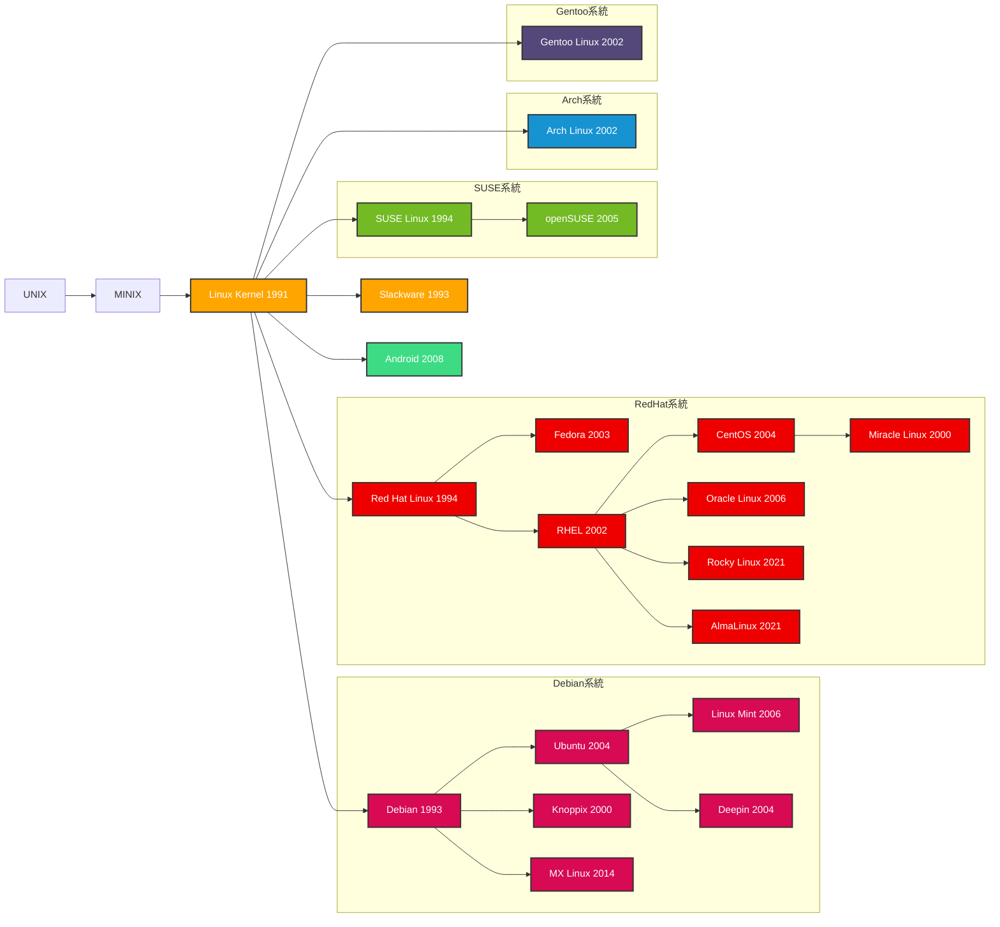

# Linux ディストリビューション 家系図

## 主要な系統

### Debian系統
- **Debian** (1993) - 最も古い系統の一つ
  - **Ubuntu** (2004) - 最も人気のあるデスクトップLinux
    - **Linux Mint** (2006) - 使いやすさ重視
    - **Deepin** (2004) - 中国発の美しいデスクトップ環境
  - **MX Linux** (2014) - 軽量で高速

### Red Hat系統
- **Red Hat Linux** (1994) - エンタープライズLinuxの先駆者
  - **Fedora** (2003) - 最新技術の実験場
  - **RHEL** (Red Hat Enterprise Linux, 2002) - エンタープライズ向け
    - **CentOS** (2004) - RHELの無償クローン
      - **Miracle Linux** (2000) - 日本のサイバートラスト社
    - **Oracle Linux** (2006) - Oracle社のエンタープライズLinux
    - **Rocky Linux** (2021) - CentOS後継
    - **AlmaLinux** (2021) - CentOS後継

### Arch系統
- **Arch Linux** (2002) - ローリングリリース、シンプル設計

### Gentoo系統
- **Gentoo Linux** (2002) - ソースベースの高度なカスタマイズ性

### SUSE系統
- **SUSE Linux** (1994) - ドイツ発
  - **openSUSE** (2005) - コミュニティ版

### その他
- **Slackware** (1993) - 最古のディストリビューションの一つ
- **Android** (2008) - Linuxカーネルベースのモバイル OS
